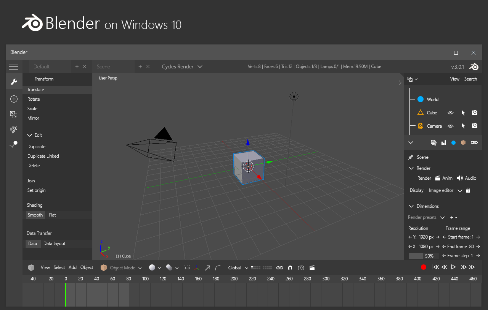

# ReFlex
It is a new Modelling Creation Tool for RedoxOS

+ Completly written in Rust!
+ Parallel Coding
+ Multithreading

+ Vulkan API
+ Without OpenGL Rendering or compatibilty or such "nonsense" stuff

## Support

+ Vulkan Rendering Engine
  + Name: ReactEngine

## Features

+ 3d printing
+ Node based Texturing
+ Global Illumination
+ OpenCollada Support
    + and more coming
+ easy to use exporter, for game engines
    + drag & drop
    + texture bake feature

## CONCEPTUAL UI DESIGN

THIS IS FROM A DEVIANART USER CALLED bannax1994

http://bannax1994.deviantart.com
